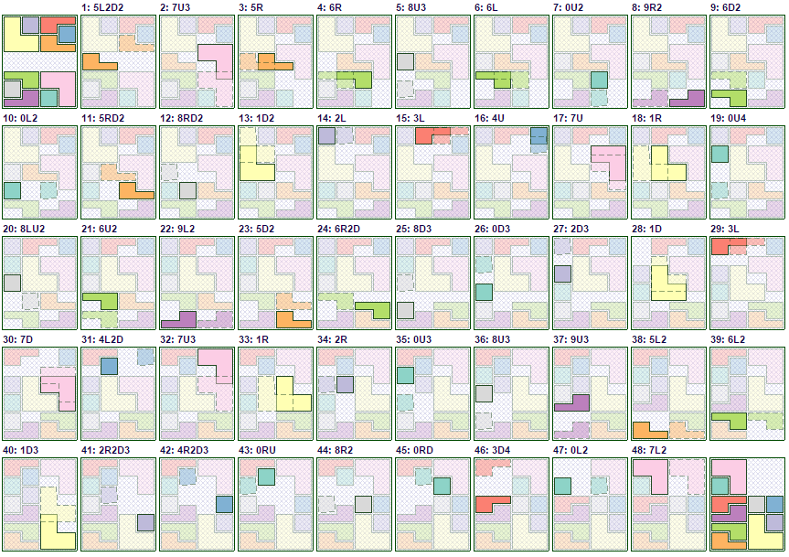

A C++ solver for sliding block puzzles (a-la [Klotski](https://en.wikipedia.org/wiki/Klotski)).

Uses A* with scaled Manhattan distance heuristics (which is non-admissible, but manages to find optimal solutions for a few well known puzzles).

Also generates an SVG output to visualize the solution, e.g. here's the Escott puzzle one:

